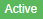
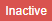

# Company Profile

This application is developed using ExpressJS, MongoDB, and NodeJS.

## Requirements

This application requires installation of NodeJS and MongoDB prior to running.

## Installation

- Please install all required dependencies by running the following command:

```
$ npm install
```

- You must enter your own MongoDB configuration settings in the index.js file:

```
mongoose.connect('mongodb://localhost/companyDb', {
    useNewUrlParser: true,
    useCreateIndex: true
});
```

- API end point for getting compony status

``` 
/company/api/Companyname

You have to replace Companyname with your company name.
```

- Change company status

``` 
You can change company status by clicking on status button. 
```

